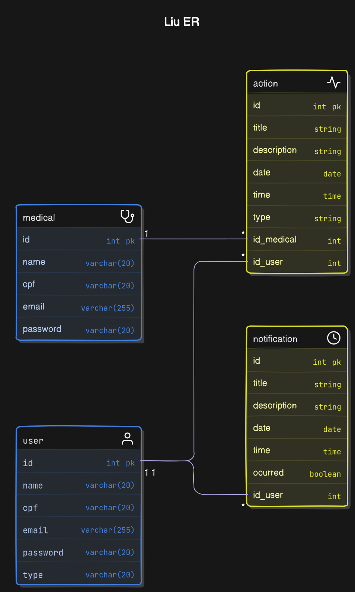

# Projeto Liu

By: [v.ii.n.i](https://github.com/gitviini/)

Projeto criado para atender pessoas com DCNTs (Doenças Crônicas Não Transmissíveis), dando autonomia e reforçando o autocuidado para trazer a indepência de volta, isso com coleta de dados e gerenciamento de rotina (Pelos próprios ou por Médicos), gerando um dashboard com overviews sobre o estado do paciente.

## ER

## Stacks utilizadas
Desenvolvimento multiplataforma: [React Native Expo](https://reactnative.dev/)
Gerenciamento de usuários: [Clerk](https://clerk.com/)
Banco de dados postgres: [Supabase](https://supabase.com)